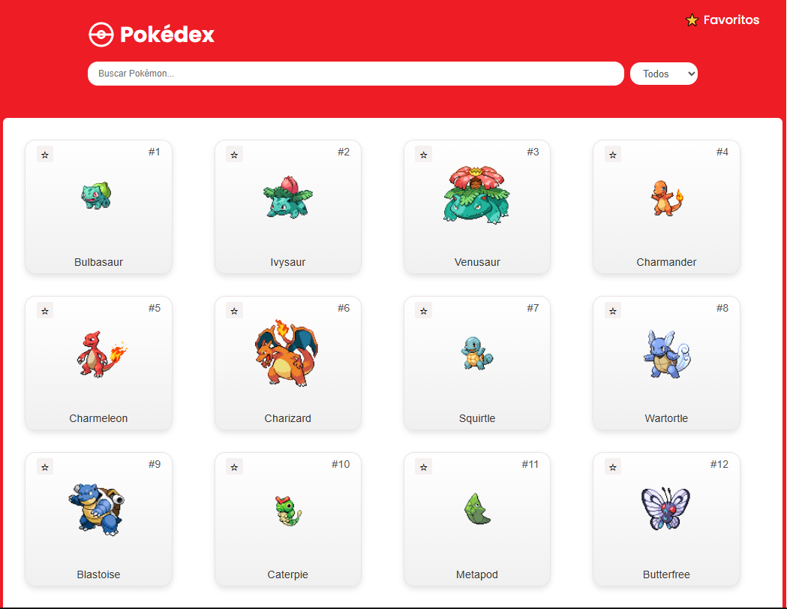
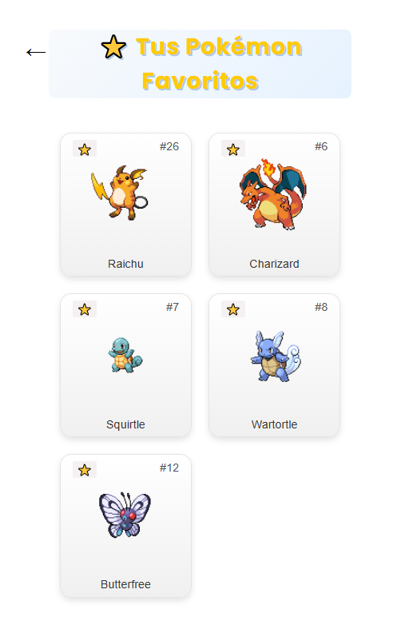
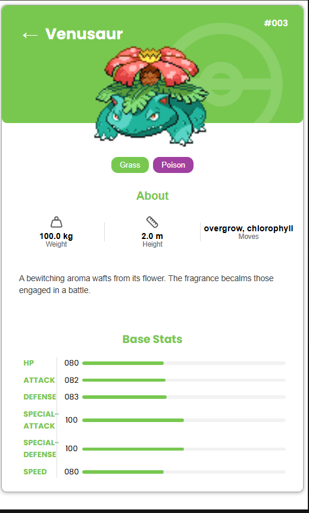

# Pokédex ⚡

Una aplicación web de Pokédex construida con **React**, **Apollo Client** y **GraphQL**.  
Permite visualizar diferentes Pokémon, filtrarlos por tipo, buscralos por nombre, además de marcar favoritos para guardarlos localmente.
Asi mismo permite vizualizar cada pokemon con sus caracterticas.

---

## 🚀 Características

- 🔎 **Búsqueda en tiempo real** de Pokémon por nombre.  
- 🌀 **Filtro por tipo dinámico** → solo muestra los tipos disponibles en los Pokémon cargados.  
- ⭐ **Gestión de favoritos** → añadir o quitar Pokémon a una lista de favoritos.  
- 🎨 **Diseño responsive** con SCSS.  
- ⚡ **Consumo de datos vía GraphQL** usando Apollo Client.

---

## 🛠️ Tecnologías

- [React](https://react.dev/)  
- [React Router](https://reactrouter.com/)  
- [Apollo Client](https://www.apollographql.com/docs/react/)  
- [GraphQL](https://graphql.org/)  
- [SCSS](https://sass-lang.com/)

---


## ⚙️ Instalación y ejecución

1. Clona el repositorio:

   ```bash
   git clone https://github.com/GeraldinHerrera/Pokedex.git
   cd pokedex-app
   npm install
   npm run dev

---

## 🖼️ Capturas

🏠 Home




⭐ Favoritos



🎈 Tarjeta de Pokemon




---
🧑‍💻 Autor 
- Geraldin Herrera – Desarrolladora Full Stack
- 📧 hgeraldin35@gmail.com 
- 💼 LinkedIn www.linkedin.com/in/geraldine-castro-herrera-3a1085211
